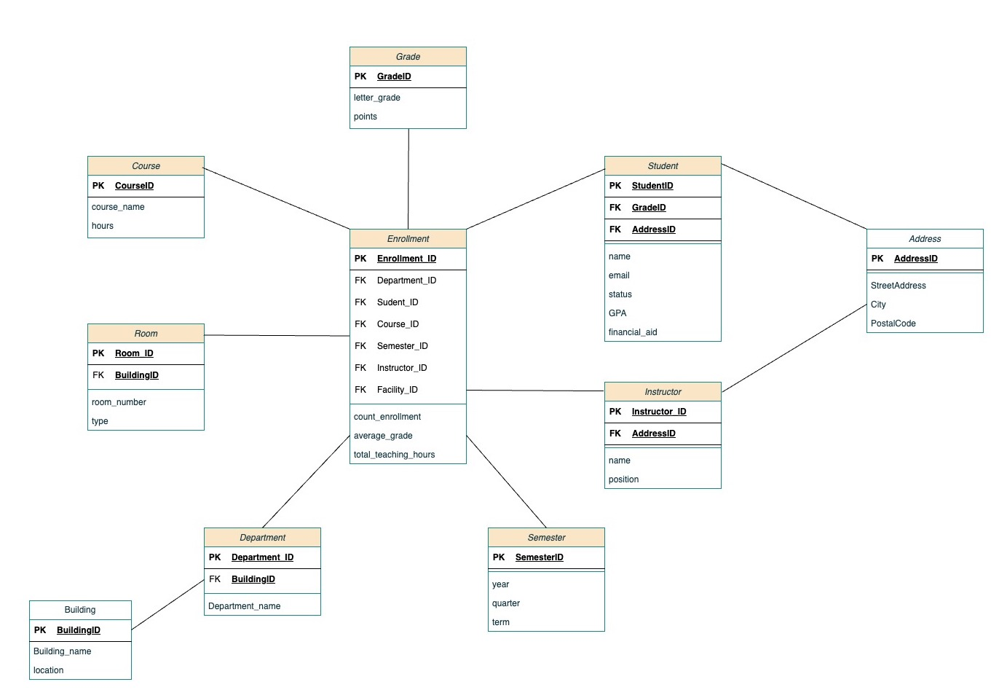

# DataWarehouse
Master project to create Snowflake schema in Data Warehouse course

## Overview:
Design a data warehouse for managing a university's academic data using PostgreSQL. Your task is to construct a data warehouse schema that allows for straightforward SQL queries. You will also explain your schema and demonstrate how it addresses data analysis needs through various queries. In your schema, enrollment will be central to the warehouse, capturing key academic metrics. The design should support queries to retrieve:

1. The count of enrolled students by department for each semester.
2. The average grade by course at the end of each term.
3. The total teaching hours by instructor over each academic year.
4. The frequency of use of facilities like lecture halls and labs by quarter.
5. The number of students graduating each year.
6. The percentage of students receiving financial aid by department.

### Part 1: Dimensional Modeling 
- Design a snowflake schema for the university's academic management system. 
- Include fact and dimensional tables, PK (Primary Keys), FK (Foreign Keys), attributes,
and measures.

### Part 2: SQL Code for Table Creation and Data Population
- [Table Creation](Create tables.sql)

### Part 3: OLAP Queries
**_3.1 Basic Aggregate Functions:_**
- **COUNT**: Count the number of students in each department per semester.
- **AVG**: Calculate the average grades for each course at the end of the term.
- **SUM**: Sum all students' final grades in each course.
- **MAX**: Determine the maximum grade achieved in each course.

**_3.2 Advanced Aggregate Function:_**
- **CUBE**: Perform a CUBE operation on the 'enrollments' table to show the total number of
enrollments per course, per semester, and overall.
- **ROLLUP**: Use ROLLUP to summarize student performance by department and then across
the entire university.
- **GROUPING**: Use GROUPING to identify the rows created by ROLLUP or CUBE in the
result set.
- **DECODE**: Use DECODE to transform coded values into meaningful descriptions within the
query output.

**_3.3 Advanced Analysis Functions:_**
- **RANK**: Rank students in each course based on their grades.
- **CUME_DIST**: Calculate the cumulative distribution of grades in each course.
______________________________________________
# Requirements
The software we used:

**[draw.io](https://app.diagrams.net/)**: online tools for making flowcharts, UML, ER, and other diagrams. we used to draw snowflake schema.

**[Postgresql](https://www.postgresql.org/download/)**: open source object-relational database. We use it to write SQL queries.
_______________________________________________
## Supervisor 
Dr. Maram Monshi

## Data Scientists Members:
- Arwa H. Alshanbari
- Shahd H. Altalhi
- Samaher S. Alsharif
- Ghalia M. Alharthi
- Razan W. Althubiti
